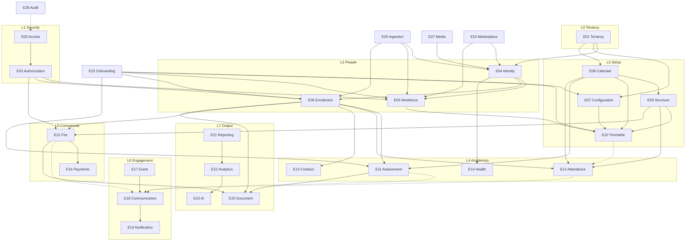

# FeezypayERP — Business Engines Architecture

> **Phase:** 0.5 — Architecture before remaining feature build  
> **Status:** Design-only · **Ownership review complete** (2026-08-06)  
> **Created:** 2026-08-06 · **Ownership review:** 2026-08-06  
> **Canonical companion:** [`docs/MASTER.md`](../MASTER.md)  
> **Rule:** Every future feature must declare which engine(s) it belongs to. If it needs data from another engine, it **reads/references** — it does not copy or re-own that data.  
> **Rule (hardened):** Every column/table has **exactly one owner engine**. Co-location on a physical table does not imply shared ownership — see §10 ownership matrix.


---

## 1. Purpose of this document

School ERPs fail architecturally when:

- Attendance stores its own “student name”
- Fees invent a parallel class/section model
- Notifications own message templates *and* delivery *and* WhatsApp business logic
- Reports mutate source tables
- AI invents shadow entities

**Business Engines** are bounded capability domains. They are not necessarily microservices. In FeezypayERP they start as **module boundaries inside one Postgres tenant model + one Next.js app**, with clear ownership of tables, APIs, and events.

### 1.1 Design principles

| # | Principle |
|---|-----------|
| P1 | **One owner per fact.** A column/table has a single engine of record. |
| P2 | **Reference, don’t duplicate.** Foreign keys / IDs across engines; no denormalized “full_name” copies except derived projections. |
| P3 | **Append history for life events.** Admissions, employments, academic years, marks, fee ledgers — prefer new rows over destructive updates. |
| P4 | **Identity is global; relationships are school-scoped.** Already locked in MASTER. |
| P5 | **AuthN ≠ AuthZ ≠ Identity.** Three engines, three concerns. |
| P6 | **Delivery ≠ content.** Notification pipes vs Communication content vs Event occurrence. |
| P7 | **Analytics never writes OLTP truth.** Read replicas / warehouses / materialized views only. |
| P8 | **AI consumes engines; it does not become a parallel ERP.** |

### 1.2 Persona vocabulary

| Persona | Meaning |
|---------|---------|
| **Platform admin** | Feezypay operator (future; not built) |
| **School admin** | Tenant owner / office staff with full school config (today’s only login) |
| **Teacher** | Via `teacher_employments` (+ future login) |
| **HOD** | Teacher with departmental authority (flag on employment today) |
| **Student** | Via `student_admissions` / `student_academic_years` |
| **Parent / guardian** | Via `parent_profiles` + `student_parent_links` |
| **Accountant / fee clerk** | Future fee operations role |
| **System** | Jobs, webhooks, AI agents acting under service credentials |

---

## 2. Engine catalog (overview)

| ID | Engine | Maturity vs MASTER | One-line purpose |
|----|--------|--------------------|------------------|
| E01 | **Tenancy Engine** | Partial `SHIPPED` | Schools as tenants; lifecycle & subscription shell |
| E02 | **Access Engine (AuthN)** | Partial `SHIPPED` | Prove who the human is in Auth |
| E03 | **Authorization Engine (RBAC)** | `NOT BUILT` (schema seeds) | Decide what an authenticated actor may do |
| E04 | **Identity Engine** | Mostly `SHIPPED` | Global humans (`persons`) + role profiles + match keys |
| E05 | **Workforce Engine** | Mostly `SHIPPED` | Teacher employment at schools |
| E06 | **Enrollment Engine** | Mostly `SHIPPED` | Student admissions + year placements + parents links |
| E07 | **Configuration Engine** | Mostly `SHIPPED` | School static/config catalogs (board, subjects, houses…) |
| E08 | **Calendar Engine** | Mostly `SHIPPED` | Academic years, terms, holidays, working days, school calendar truth |
| E09 | **Structure Engine** | Mostly `SHIPPED` | Classes, sections, capacity, promotion topology |
| E10 | **Timetable Engine** | Mostly `SHIPPED` | Periods, grids, cycle days, slots, availability, locks, conflict detection |
| E11 | **Assessment Engine** | Config `SHIPPED` + Ops backend `SHIPPED` (UI `NOT BUILT`) | Exam definitions + append-only marks — [`assessment-operations-engine.md`](assessment-operations-engine.md) |
| E12 | **Attendance Engine** | Backend `SHIPPED` (UI `NOT BUILT`; period FUTURE) | Presence / absence facts — [`attendance-engine.md`](attendance-engine.md) |
| E13 | **Conduct Engine** | Backend `SHIPPED` (UI `NOT BUILT`) | Behaviour remarks + follow-ups — [`behaviour-engine.md`](behaviour-engine.md) |
| E14 | **Health Engine** | `DEFERRED` | Lifelong medical attributes & incidents |
| E15 | **Fee Engine** | `NOT BUILT` (brand core) | Fee structures, invoices, student ledger |
| E16 | **Payments Engine** | `NOT BUILT` | Payment rails, settlements, reconciliations |
| E17 | **Event Engine** | Calendar `SHIPPED` + Activity ops backend `SHIPPED` (UI/media later) | Occasions + participation — [`event-activity-engine.md`](event-activity-engine.md) |
| E18 | **Communication Engine** | Config `SHIPPED` (§37); ops compose `SHIPPED` (§49); UI `NOT BUILT` | Templates/categories/rules + `comm_messages`; delivery is E19 |
| E19 | **Notification Engine** | Minimal pipe `SHIPPED` (§49); providers stubbed | Delivery requests, attempts, outbox, read receipts; adapters future |
| E20 | **Document Engine** | Templates `SHIPPED` + Issue backend `SHIPPED` (PDF media `NOT BUILT`) | Report cards assemble from sources; version history — [`report-card-engine.md`](report-card-engine.md) |
| E21 | **Reporting Engine** | `NOT BUILT` | Operational reports & exports |
| E22 | **Analytics Engine** | Student §51 + Teacher §52 slices `SHIPPED`; school-wide marts later | Deterministic aggregates + snapshots — [`student-analytics-engine.md`](student-analytics-engine.md) · [`teacher-analytics-engine.md`](teacher-analytics-engine.md) |
| E23 | **AI Engine** | `NOT BUILT` | Assistive insights, drafting, anomaly hints |
| E24 | **Marketplace Engine** | `DEFERRED` | Public/verified teacher profiles & discovery |
| E25 | **Onboarding Engine** | Mostly `SHIPPED` | Wizard orchestration & completion gates |
| E26 | **Ingestion Engine** | Partial `SHIPPED` | CSV/API bulk import validation & mapping |
| E27 | **Media Engine** | Partial `SHIPPED` | Logos, photos, file storage metadata |
| E28 | **Audit Engine** | Partial `SHIPPED` (config writes) | `audit_entries` via editing framework; full retention/SIEM later |
| E29 | **Membership Engine** | `SHIPPED` | Person↔school index, preferences, switch — [`membership-engine.md`](membership-engine.md) |
| E30 | **Curriculum Engine** | Backend `SHIPPED` (UI later) | Year/board/grade/subject packs + hierarchy + publish versions — [`curriculum-engine.md`](curriculum-engine.md) |
| E31 | **Assessment Framework Engine** | Backend `SHIPPED` (UI later) | Year×class×subject evaluation plan + categories + formulas — [`assessment-framework-engine.md`](assessment-framework-engine.md) |
| E32 | **Assessment Recording Engine** | Backend `SHIPPED` (UI later) | Teacher evidence under framework categories; append-only marks — [`assessment-recording-engine.md`](assessment-recording-engine.md) |

---

## 3. Anti-overlap matrix (hard boundaries)

| Temptation | Correct owner | Must not |
|------------|---------------|----------|
| Store student display name on attendance row | Identity (+ Enrollment for school context) | Attendance must not own `full_name` |
| Store class list inside Fee module | Structure Engine | Fees reference `class_id` / `section_id` |
| WhatsApp send logic inside Event create | Notification Engine | Event emits “notify interested parties”; Notification delivers |
| Marks overwritten each term | Assessment Engine (append-only results) | No single mutable “current marks” blob as sole truth |
| AI writes admissions | Enrollment Engine only | AI proposes; humans/engines commit |
| Report “fixes” data | Reporting is read-only | Corrections go through owning engine |
| Parent phone only on fee invoice | Identity / Enrollment | Fee references `person_id` / parent link |
| Timetable owns academic year dates | Calendar Engine | Timetable references `academic_year_id` |
| Employment stores Aadhaar | Identity Engine | Employment stores job fields only |
| RBAC checks inside every SQL table ad hoc forever | Authorization Engine | Central permission model; RLS enforces tenant + role |

---

## 4. Engine specifications

Each engine below uses the same template.

---

### E01 — Tenancy Engine

**Purpose**  
Define and lifecycle-manage a school as a SaaS tenant.

**Responsibilities**
- Create/suspend/close tenants (`schools`)
- Hold tenant-level flags that are *not* academic config (e.g. `onboarding_status`, plan tier later)
- Own cross-cutting tenant metadata (legal name, timezone later, locale later)
- Coordinate “delete school” cascade policy (school-scoped rows die; persons survive)

**Data owned**
- `schools.id` and **tenant lifecycle** columns: `onboarding_status`, future plan/subscription/suspend fields, created/updated timestamps for tenant ops
- **`profiles`** as *school-admin membership* (`id` → auth user, `school_id`, `role='school_admin'` today) — long-term may evolve to an admin-link table still owned by Tenancy
- Future: `school_subscriptions`, SaaS billing accounts (≠ student fees)

**Data it must never own**
- School **branding/identity/config** columns on `schools` (name, board, address, logo path, `houses_enabled`, `clubs_enabled`, `academic_year_start_month`) — **E07 / E08** (see §10)
- Wizard progress flags `houses_clubs_completed`, `timetable_skipped` — **E25** (see §10)
- Humans (`persons`), employments, admissions, marks, attendance
- Academic catalogs (subjects, terms)

**Inputs**
- Signup intent (create school)
- Platform admin ops (future)
- Onboarding completion signal

**Outputs**
- Stable `school_id`
- Tenant status for gating features

**Dependencies**
- Access Engine (who may create/manage tenant)
- Authorization Engine (who is school admin)

**Future scalability**
- Multi-campus under one trust (campus as child tenant or site entity)
- White-label / reseller tenancy
- Soft-delete + data export packages

**Personas**
- School admin, Platform admin, System

---

### E02 — Access Engine (AuthN)

**Purpose**  
Authenticate humans to the platform (sessions, passwords, magic links, MFA later).

**Responsibilities**
- Signup / login / logout / password reset / session refresh
- Bind `auth.users` ↔ application identity **pointer** (`persons.auth_user_id`) — *link only*
- Invite token issuance (with service role) — *credential delivery*, not RBAC policy

**Data owned**
- Supabase `auth.users` / sessions (provider-owned)
- Future: invite tokens metadata (credential lifecycle only)
- Does **not** own `persons.email` (Identity) — Auth email is login credential copy managed by provider

**Data it must never own**
- Roles/permissions (Authorization)
- School membership facts (Workforce / Enrollment / Tenancy `profiles`)
- Writing `person_roles`
- Owning `persons` row (only requests Identity to set `auth_user_id`)
**Inputs**
- Credentials, OTP, OAuth (future)
- Invite acceptance

**Outputs**
- `auth.uid()` / session claims
- Recovery sessions

**Dependencies**
- Tenancy (only for “create school” signup path)
- Identity (to attach `auth_user_id` after invite)
- Notification (to deliver reset/invite emails — or Auth’s mailer)

**Future scalability**
- MFA, SSO (Google Workspace for schools), device sessions
- Split signup: create-school vs accept-invite (MASTER F11)

**Personas**
- All humans who log in; System for service accounts

---

### E03 — Authorization Engine (RBAC)

**Purpose**  
Answer: *given this `auth.uid()`, may they perform action X on resource in school Y?*

**Responsibilities**
- Map person → roles (`person_roles`) + school links (employment/admission/admin profile)
- Permission matrix (resource × action × role × optional designation/HOD)
- Drive RLS policies / server-side guards consistently
- Support multi-role (teacher + parent)

**Data owned**
- Permission catalog (future): `permissions`, `role_permissions`, school custom roles, temporary grants
- Policy evaluation helpers / RLS predicate builders
- **Read-only consumption** of `person_roles`, `profiles`, employments, admissions as *evidence* — does not own those tables

**Data it must never own**
- `person_roles` rows (E04 writes)
- `profiles` rows (E01 owns school-admin membership — see §10)
- Business facts (marks, fees, attendance)
- Identity PII
- Notification content

**Inputs**
- `auth.uid()`, target `school_id`, action, resource ids
- Employment/admission status (active?)

**Outputs**
- Allow / deny (+ reason codes for UX)
- Scoped query predicates

**Dependencies**
- Access (authenticated principal)
- Identity (person resolution)
- Workforce / Enrollment / Tenancy (membership evidence)

**Future scalability**
- Custom roles per school
- Attribute-based rules (class teacher of section S)
- Temporary delegations
- Full matrix: [`rbac.md`](rbac.md)

**Personas**
- All authenticated personas; School admin configures custom roles later — see [`rbac.md`](rbac.md)

---

### E04 — Identity Engine

**Purpose**  
Single global registry of humans and lifelong attributes.

**Responsibilities**
- Create/match/update `persons` (Aadhaar hash + email uniqueness)
- Maintain role profiles: `teacher_profiles`, `student_profiles`, `parent_profiles`
- Global IDs (`PER/TCH/STD/PAR`)
- Profile completion state (`profile_completed_at`)
- Never store school-specific job/admission fields here

**Data owned**
- `persons` and lifelong non-medical fields on role profiles (`teacher_profiles` career fields, `student_profiles` non-health fields, `parent_profiles`)
- **`person_roles` rows** (Identity is sole writer when a profile is created/destroyed)
- Identity RPCs / Aadhaar helpers
- `persons.auth_user_id` **pointer column** (written when Access completes bind; Identity owns the column as part of `persons`)
- `persons.profile_completed_at`

**Data it must never own**
- Permission catalogs / allow-deny decisions (E03)
- `school_id` on person
- Fee balances, marks, attendance
- Timetable slots
- Employment designation / employee_code (Workforce)
- Admission number (Enrollment)
- `blood_group` / `medical_notes` / medical incidents (**E14 Health** — even if columns physically sit on `student_profiles` today)

**Inputs**
- Onboarding/staff/student forms, invites, self-profile wizard
- Match keys (aadhaar, email)

**Outputs**
- `person_id`, profile ids, global ids
- Conflict errors on identity clash

**Dependencies**
- Access (optional link to auth user)
- Media (photo_path)
- Ingestion (bulk person upsert)

**Future scalability**
- Millions of persons; hash indexes already planned
- Cross-school continuity (same teacher, many employments)
- Verification / KYC providers

**Personas**
- School admin, Teacher, Parent, Student, Platform admin, System

---

### E05 — Workforce Engine

**Purpose**  
Model a person’s **job relationship** with a school (employment history).

**Responsibilities**
- `teacher_employments` lifecycle: invited → active → ended
- **Department Engine surface:** departments, heads/coordinators/members, dept subjects, teaching relationships, announcements, resources, history
- Subject teaching eligibility at employment (`employment_subjects`)
- Provide employment IDs to Timetable / Structure (class teacher)

**Data owned**
- `teacher_employments`, `employment_subjects` (**capability**: subjects this employment is eligible to teach)
- `departments`, `department_memberships`, `department_subjects`, `department_teaching_assignments`, `department_announcements`, `department_resources`, `department_history`
- Future: leave/HR extensions that are employment-scoped

**Data it must never own**
- Person PII / Aadhaar / TeacherProfile identity rows
- Timetable slot grid or `teacher_subject_assignments` (**E10** owns concrete schedule mapping)
- Student data
- Auth passwords
- Subject catalog definitions (**E07**)
**Inputs**
- Staff onboarding / HR updates / `lib/departments/*`
- Invite acceptance (status flip)

**Outputs**
- Active employment lists per school
- Department membership & assignment graphs
- Employment id as actor key for teaching duties

**Dependencies**
- Identity (teacher profile)
- Tenancy (school)
- Configuration (subjects catalog for assignment validation)
- Authorization (who may hire/edit)
- Notification (invite/reset emails — trigger only)

**Future scalability**
- Multi-school careers; substitute teachers; contract types
- Nested departments; cost centers; marketplace verification consumes employment history (read)

**Personas**
- School admin, Teacher, HOD, Platform admin

---

### E06 — Enrollment Engine

**Purpose**  
Model a student’s **school relationship** and year-by-year placement.

**Responsibilities**
- Admissions (`student_admissions`) and statuses (active/withdrawn/alumni/transferred)
- Academic year placements (`student_academic_years`) — append-only history
- Parent links for a student profile
- Admission numbers unique per school
- Transfers/exits without destroying history

**Data owned**
- `student_admissions`, `student_academic_years`, `student_parent_links`
- Future: transfer applications, promotion batches (orchestration may call Structure)

**Data it must never own**
- Lifelong medical notes (Health; may live on student_profile with Health ownership rules)
- Marks (Assessment)
- Attendance days (Attendance)
- Fee invoices (Fee)
- Class/section definitions (Structure)

**Inputs**
- Student onboarding / mid-year admission / promotion / transfer
- Structure ids (class/section), Calendar year id, optional house id

**Outputs**
- Admission id, academic-year placement id
- “Who is in section S this year?”

**Dependencies**
- Identity (student + parent profiles)
- Structure (class/section)
- Calendar (academic_year)
- Configuration (houses optional)
- Authorization

**Future scalability**
- Inter-school transfers with portable person
- Twin/sibling grouping
- Boarding / transport affiliations as satellite engines later

**Personas**
- School admin, Parent, Student, Teacher (read), Accountant (read)

---

### E07 — Configuration Engine

**Purpose**  
School-level **catalogs and settings** that change infrequently and parameterize other engines.

**Responsibilities**
- School identity display fields (board, address, logo reference, grading preferences later)
- **Subject Configuration surface:** subject master, groups, dependencies, board/credits/periods/lab/assessment rules
- **House & Club Engine surface:** houses/clubs catalog, colours/logos, TIC, memberships, captains
- Feature flags that are config (houses_enabled), not lifecycle (onboarding_status → Tenancy)
- Grading scales / mark schemes config (shared with Assessment; Assessment owns results)
- **School Policy Engine surface:** versioned attendance/promotion/timings/leave/exam/grace/behaviour policies (`lib/policies/`)

**Data owned**
- `subjects`, `subject_groups`, `subject_dependencies`, `class_subjects`, `houses`, `clubs`, `house_memberships`, `club_memberships`
- Stub: `subject_textbooks`, `house_point_ledger`, `club_event_links`
- **School branding/config columns** on `schools`: `name`, board/address/contact identity fields, logo reference, `houses_enabled`, `clubs_enabled`
- `grading_scales` / mark-scheme **definitions** (Assessment owns results; may reference scale id)
- `school_policies`, `school_policy_versions` (fee/transport kinds stubbed)
- Does **not** own `departments` (E05) or `academic_year_start_month` (E08)

**Data it must never own**
- Runtime timetable slots
- Person / TeacherProfile identity rows (TIC is employment FK only)
- Marks / attendance **facts**
- Payment transactions
- Tenant lifecycle (`onboarding_status`) or wizard flags
**Inputs**
- Onboarding steps (identity, subjects, houses/clubs)
- Admin `/dashboard/houses-clubs` + `lib/houses-clubs/*`
- Admin policy APIs via `lib/policies/*`

**Outputs**
- Valid subject/house/club ids and membership graphs for other engines
- Current policy version rules for E09/E11/E12/E13 consumers

**Dependencies**
- Tenancy
- Structure (for class_subjects)
- Media (logos)
- Authorization
- Workforce (TIC employment ids)

**Future scalability**
- Config versioning per academic year (subject offered in 2025 but not 2026)
- House points / club events / competitions
- Templates for new schools
- Fee / transport policy runtime

**Personas**
- School admin, HOD (limited), Platform admin (templates)

**Phase 1 note:** School Policy Engine — [`school-policy-engine.md`](school-policy-engine.md).

---

### E08 — Calendar Engine

**Purpose**  
Authoritative **time structure** of the school: years, terms, holidays, working days.

**Responsibilities**
- `academic_years` (active year + draft/active/closed lifecycle)
- `terms` (month/day patterns or dated ranges; archive)
- `school_working_day_patterns` (instructional weekdays)
- `holidays` (non-instructional ranges)
- Define “what day is instructional”

**Data owned**
- `academic_years`, `terms`, `school_working_day_patterns`, `holidays`
- **`schools.academic_year_start_month`** (calendar policy for the tenant)

**Data it must never own**
- Period bell times / teaching slots (Timetable)
- PTM/sports **Event** entities (Event Engine) — holidays ≠ events
- Attendance records
- Exam mark values (Assessment)
**Inputs**
- Onboarding terms step; `/dashboard/calendar`; `lib/calendar/*`

**Outputs**
- `academic_year_id`, term ids, instructional-day answers, holiday ranges

**Dependencies**
- Tenancy
- Authorization

**Future scalability**
- Multi-board calendars; trimester vs semester packs
- Sync to Google Calendar (via Notification/Integration later)
- Exam windows as calendar blocks (Assessment references them)

**Personas**
- School admin, Teacher (read), Parent (read)

---

### E09 — Structure Engine

**Purpose**  
Academic **org chart** inside a year: classes, sections, capacity, promotion graph.

**Responsibilities**
- `classes`, `sections`
- Capacity invariants (class ↔ sum of sections)
- Class teacher assignment (**stores employment id**, does not own workforce)
- Future: promotion pathways (Class 5 → Class 6)

**Data owned**
- `classes`, `sections` (+ capacity fields)
- Future: `promotion_rules`

**Data it must never own**
- Who the students are (Enrollment)
- What subjects exist (Configuration)
- When the year starts (Calendar)

**Inputs**
- Onboarding classes/sections; yearly rollover

**Outputs**
- `class_id` / `section_id` for Enrollment, Timetable, Attendance, Fees

**Dependencies**
- Calendar (year)
- Workforce (class teacher employment id)
- Authorization

**Future scalability**
- Streams (Science/Commerce), combined sections, house-based groupings

**Personas**
- School admin, Teacher (read), HOD

---

### E10 — Timetable Engine

**Purpose**  
Schedule teaching periods: who teaches what, where, when.

**Responsibilities**
- `period_definitions`, `timetable_slots`, `teacher_subject_assignments`
- `timetable_grids`, `timetable_cycle_days` (weekly + alternate)
- Conflict detection (teacher/section/room double-book, availability, locks)
- Teacher & section availability calendars
- Period / slot locking
- Skip/partial configuration flags coordination with Onboarding (`timetable_skipped` — E25)

**Data owned**
- Periods, grids, cycle days, slots, availability tables
- `teacher_subject_assignments` when used as **schedule planning map** (≠ E05 eligibility)
- Stub: `rooms`, `timetable_substitutions`

**Data it must never own**
- Employment master data / eligibility subject lists (E05)
- Subject catalog definitions (E07)
- Attendance taken in a period (E12 references slot optionally)
- `schools.timetable_skipped` (E25 wizard flag)
**Inputs**
- Structure sections, Configuration subjects, Workforce employments, Calendar year
- `lib/timetable/*` engine APIs

**Outputs**
- Slot grid; conflict reports; “teacher T free?” via availability

**Dependencies**
- Structure, Configuration, Workforce, Calendar
- Authorization

**Future scalability**
- Room resources, substitution workflow, rotating schedules UI

**Personas**
- School admin, Teacher, HOD, Student/Parent (read)

**Phase 2 note:** Assigned homework / projects are **not** Timetable slots. Owned by Homework & Assignment Engine — [`homework-assignment-engine.md`](homework-assignment-engine.md) · MASTER §50 · `lib/homework/`. Lesson-plan drafts (WF-TCH-07) may still land under E10 later.

---

### E11 — Assessment Engine

**Purpose**  
Define assessments and record **append-only results**.

**Phase 1 note:** Assessment **Configuration** — [`assessment-configuration-engine.md`](assessment-configuration-engine.md) · `lib/assessment/` config actions.

**Phase 2 note:** Assessment **Operations** (marks) backend shipped — [`assessment-operations-engine.md`](assessment-operations-engine.md) · migration `20260807260000`. Mark sessions (`draft`→`published`→`locked`); teacher-created kinds; bulk/single entry; remarks; corrections; audit; analytics. UI `NOT BUILT`.

**Responsibilities**
- `exam_definitions` (+ schedules) — **config shipped** (`lib/assessment/`)
- Exam types, categories, components, weightages, pass marks, publish/lock rules
- `exam_results` linked to student + year + subject + exam (ops shipped)
- Weightages, grading_type; compute derived totals via views/queries
- Never overwrite prior year / locked historical marks (supersede + correct)

**Data owned**
- Exam definitions/schedules/components/policies/types/categories
- Results tables + mark sessions + results audit
- Rubrics if skill-based (future)

**Data it must never own**
- Student master / admission
- Fee consequences of failing (Fee may react to events)
- Report PDF binaries (Document Engine renders from results)
- Grading scale **definitions** (E07; E11 pins versions)

**Inputs**
- Calendar terms; Configuration subjects/groups/scales; Enrollment placements; Timetable optional

**Outputs**
- Published assessment **definitions** (config); marks/grades for Document/Reporting/Analytics

**Dependencies**
- Calendar, Configuration, Enrollment, Structure
- Authorization (who may enter / lock marks)

**Future scalability**
- Continuous evaluation, competency frameworks, moderation workflows, AI evaluation (flags stubbed)

**Personas**
- School admin, Teacher, HOD, Student/Parent (read), Platform (benchmarks later)

---

### E12 — Attendance Engine

**Purpose**  
Record presence facts for students (and optionally staff).

**Phase 2 note:** Backend shipped — [`attendance-engine.md`](attendance-engine.md) · `lib/attendance/` · migration `20260807250000`. Sessions (draft→submitted→approved→locked); leave; corrections; audit; analytics. Period marks API stubbed. UI `NOT BUILT`.

**Responsibilities**
- Daily / period attendance rows
- Summaries as **derived** data (materialized), not duplicated source of truth
- Integrate with Timetable period optionally

**Data owned**
- Attendance fact tables; derived summary tables

**Data it must never own**
- Student names, parent phones
- Fee fines logic (emit event → Fee may create fine)

**Inputs**
- Enrollment placement; Structure section; Calendar date; optional Timetable slot
- Teacher submissions

**Outputs**
- Present/absent/late facts; alerts to Notification

**Dependencies**
- Enrollment, Structure, Calendar, (Timetable), Authorization, Notification

**Future scalability**
- Biometric devices, RFID; staff attendance

**Personas**
- Teacher, School admin, Parent (read), Student (read)

---

### E13 — Conduct Engine

**Purpose**  
Behaviour incidents, discipline actions, qualitative remarks.

**Phase 2 note:** Behaviour Engine backend shipped — [`behaviour-engine.md`](behaviour-engine.md) · `lib/behaviour/` · migration `20260807290000`. Remark kinds (positive/disciplinary/warning/commendation/teacher_note); visibility; follow-ups; year filter; derived analytics. UI `NOT BUILT`.

**Responsibilities**
- Timestamped remarks / incidents linked to student profile + academic year
- Severity, follow-up actions, visibility / confidentiality flags

**Data owned**
- `conduct_incidents` (enriched), `behaviour_follow_ups`, `behaviour_audit_log`

**Data it must never own**
- Health diagnoses (Health)
- Attendance absences (Attendance)
- Identity PII copies
- Assessment / report-card remark fields (E11/E20)

**Inputs**
- Teacher/admin reports; Enrollment placement context; E07 `behaviour_rules` thresholds

**Outputs**
- Conduct history for Document (TC / report cards) / Parent notifications

**Dependencies**
- Identity, Enrollment, Calendar, Authorization, Notification, Document

**Future scalability**
- Positive behaviour points dashboards; counseling case packs; AI summaries

**Personas**
- Teacher, School admin, Parent (controlled), Counselor

---

### E14 — Health Engine

**Purpose**  
Lifelong and incident health data for students (and staff later).

**Responsibilities**
- Blood group, allergies, medical notes on/near `student_profiles`
- Immunization / incident logs (future)
- Consent-aware sharing

**Data owned**
- Health attributes: **`student_profiles.blood_group`**, **`student_profiles.medical_notes`** (column-level ownership; table shell remains Identity/Enrollment-adjacent)
- Future medical incident / immunization tables

**Data it must never own**
- Admission numbers, fee data, marks
- Non-medical student profile fields (name comes from Identity `persons`)
**Inputs**
- Parent/admin updates; Identity student profile

**Outputs**
- Alerts for trips/events; teacher “need to know” views

**Dependencies**
- Identity, Enrollment (who is currently enrolled — for access), Authorization, Notification

**Future scalability**
- EHR integrations; privacy compartments stricter than normal RLS

**Personas**
- Parent, School admin (nurse), Teacher (limited), Student (age-gated)

---

### E15 — Fee Engine

**Purpose**  
Define what families owe and maintain the **student fee ledger** (Feezypay core domain).

**Responsibilities**
- Fee structures / heads / packages by class-year
- Invoice generation, discounts, scholarships, fines
- Student account balance (ledger entries)
- Map invoices to persons/admissions — not to free-text names

**Data owned**
- Fee plans, invoices, ledger entries, concessions

**Data it must never own**
- Payment gateway settlements (Payments Engine)
- Class definitions (Structure)
- WhatsApp templates (Communication)

**Inputs**
- Structure + Calendar (what class/year)
- Enrollment (who is billed)
- Events from Attendance/Conduct (optional fines)
- Config currency/locale (Tenancy/Config)

**Outputs**
- Invoices & balances; “amount due” for Payments
- Events: invoice_created, overdue

**Dependencies**
- Enrollment, Structure, Calendar, Identity (payer person), Authorization, Notification
- Payments (for settlement status callbacks)

**Future scalability**
- Sibling discounts, multi-year plans, vendor billing (transport)

**Personas**
- School admin, Accountant, Parent, Student (read), Platform

---

### E16 — Payments Engine

**Purpose**  
Move money and reconcile it; stay thin relative to Fee.

**Responsibilities**
- Payment intents, provider charges, refunds, webhooks
- Reconciliation against Fee ledger
- Receipts references (Document may render)

**Data owned**
- Payment transactions, provider refs, settlement batches

**Data it must never own**
- Fee structure definitions
- Student academic data

**Inputs**
- Fee invoice id + amount
- Provider webhooks

**Outputs**
- Payment success/fail → Fee ledger credit
- Receipt ids

**Dependencies**
- Fee, Access (payer login), Notification, Audit

**Future scalability**
- UPI/cards/netbanking; payout to school accounts; escrow

**Personas**
- Parent, Accountant, School admin, System (webhooks)

---

### E17 — Event Engine

**Purpose**  
First-class school events (PTM, annual day, sports, clubs, houses, cultural) distinct from Calendar holidays and Timetable periods.

**Phase 1 note:** `calendar_events` CRUD via Academic Calendar — [`academic-calendar-engine.md`](academic-calendar-engine.md).

**Phase 2 note:** Event & Activity ops backend shipped — [`event-activity-engine.md`](event-activity-engine.md) · `lib/events/` · migration `20260807280000`. Staff, participants, attendance, awards, positions, certificates, remarks, media refs. Profile reads by FK.

**Responsibilities**
- Event entities on `calendar_events`: time range, audience, venue, category
- Staff assignments, student participation, outcomes, certificate links
- Emit “notify audience” intents (still stubbed)

**Data owned**
- `calendar_events` (+ house/club scope)
- `event_staff_assignments`, `event_participants`, competition projections, activity audit

**Data it must never own**
- Holiday master (Calendar / E08)
- Message body templates long-term (Communication)
- SMTP delivery (Notification)
- Duplicated event bodies on student profile rows

**Inputs**
- Admin/teacher creates via `lib/events` (activity) or `lib/calendar/events-actions.ts`

**Outputs**
- Event + participation facts; certificate docs via E20; notification intents later

**Dependencies**
- Calendar, Structure/Enrollment, House/Club, Communication, Notification, Authorization, Document

**Future scalability**
- Ticketing, paid events → Fee/Payments; RRULE expansion; E27 media bytes; DigiLocker certificates

**Personas**
- School admin, Teacher, Parent, Student

---

### E18 — Communication Engine

**Purpose**  
**Content and conversations**: announcements, threads, WhatsApp/email copy, consent preferences.

**Responsibilities**
- Announcement records, operational messages (`comm_messages`)
- Template content & localization (**config shipped** — `lib/communications/`)
- Announcement categories, priority levels, audience groups, delivery/approval rules (config)
- Consent / opt-in flags (e.g. WhatsApp) — seeded conceptually on guardians
- Audience resolution at publish (`resolveMessageAudience`)

**Data owned**
- Messages (`comm_messages`), templates + versions, consent preferences (future), announcement entities
- `comm_*` configuration tables (categories, priorities, audiences, delivery/approval rules)
- FUTURE shells: `comm_automations`, `comm_campaigns`

**Data it must never own**
- Provider delivery logs/retries (Notification)
- Fee balances
- Auth credentials

**Inputs**
- Authors (admin/teacher); Event/Fee/Attendance triggers requesting a message

**Outputs**
- Template / rule configuration; rendered message payloads handed to Notification
- In-app inbox items via E19 delivery requests

**Dependencies**
- Identity/Enrollment (recipients), Authorization, Notification, Event/Fee/Assessment as producers

**Future scalability**
- Two-way WhatsApp; translation; moderation; automation/campaign execution
- Delivery deep-dive: [`notification-engine.md`](notification-engine.md) (E19); this engine stays content/consent

**Personas**
- School admin, Teacher, Parent, Student

**Phase 1 note:** Communication Configuration Engine — [`communication-configuration-engine.md`](communication-configuration-engine.md). **No sending.**

**Phase 2 note:** Communication Operations — [`communication-operations-engine.md`](communication-operations-engine.md). Compose + fan-out to E19.

---

### E19 — Notification Engine

**Purpose**  
Reliable **delivery** across channels (email, WhatsApp, SMS, push, in-app).

**Responsibilities**
- Queue, retry, backoff, idempotency keys
- Delivery requests / attempts / outbox (tables + `lib/notifications/`)
- Channel adapters (in_app live; others stubbed)
- Read receipts + notification history

**Data owned**
- Notification jobs, delivery attempts, provider message ids
- `notification_types`, `notification_delivery_requests`, `notification_delivery_attempts`, `notification_outbox`

**Data it must never own**
- Editorial long-form as source of truth (Communication)
- Fee balances, marks

**Inputs**
- Prefer receiving *already-rendered* or structured payloads from Communication

**Outputs**
- Notification jobs, delivery attempts, provider message ids
- Delivery status / read receipts

**Dependencies**
- Communication payloads; Access password emails (or Auth mailer)
- Preference checks (Communication consent)

**Personas**
- All recipients

**Architecture:** [`notification-engine.md`](notification-engine.md) · runtime [`communication-operations-engine.md`](communication-operations-engine.md) §49

**Future scalability**
- Priority queues; quiet hours; multi-provider failover; Twilio / Meta / SES / FCM adapters
- Delivery status webhooks

**Personas**
- System primarily; admins view delivery logs — see [`notification-engine.md`](notification-engine.md)

---

### E20 — Document Engine

**Purpose**  
Generate and store official documents (report cards, TC, fee receipts, ID cards).

**Responsibilities**
- Templates, render jobs, signed PDFs
- Versioning of issued certificates
- Hash/integrity for verification
- **Phase 1 shipped:** report card **templates** (`lib/report-cards/`) — boards, scopes, dynamic blocks, assessment refs, signature slots, immutable versions
- **Phase 2 shipped:** report card **issue** — assemble from E11/E12/E13/house/club + remarks/promotion; `report_card_issues` + version history; no parallel marks store

**Data owned**
- Templates, issued document metadata, storage pointers
- Report card template versions / scopes / blocks / signature config
- Report card issues / issue versions / issue audit

**Data it must never own**
- Underlying marks/fees as OLTP (reads Assessment/Fee/Enrollment; `source_refs` pointers only)
- Original attendance facts

**Inputs**
- Assessment definitions + results; Enrollment; Attendance aggregates; Conduct; house/club; Identity

**Outputs**
- Template configuration; issued report card versions (+ future PDF artifacts)

**Dependencies**
- Enrollment, Assessment, Fee, Identity, Media, Authorization, Audit, Attendance, Conduct

**Future scalability**
- DigiLocker; QR verify; bulk generation; digital signatures (`report_card_render_jobs` queued on issue)

**Personas**
- School admin, Parent, Student, Teacher (progress reports)

**Phase 1 note:** Templates — [`report-card-template-engine.md`](report-card-template-engine.md).  
**Phase 2 note:** Issue — [`report-card-engine.md`](report-card-engine.md) · migration `20260807270000`.

---

### E21 — Reporting Engine

**Purpose**  
Operational reports for running the school day-to-day (lists, registers, compliance exports).

**Responsibilities**
- Parameterized report definitions
- CSV/PDF exports
- Access-controlled execution

**Data owned**
- Report definitions, execution logs (not source facts)

**Data it must never own**
- OLTP mutations
- Analytics warehouse tables (Analytics)

**Inputs**
- Read models from other engines

**Outputs**
- Files / printable layouts

**Dependencies**
- All OLTP engines (read), Authorization, Document (optional render), Audit

**Future scalability**
- Scheduled reports via Notification email

**Personas**
- School admin, Accountant, HOD, Platform

---

### E22 — Analytics Engine

**Purpose**  
Aggregations, trends, benchmarks — **read-only**, eventually consistent.

**Responsibilities**
- Pipelines from OLTP → warehouse/marts
- Dashboards (attendance %, fee collection %, learning outcomes)
- Cohort analysis

**Data owned**
- Marts, aggregates, feature store inputs for AI

**Data it must never own**
- Write path to admissions/marks/fees

**Inputs**
- CDC / ETL from engines

**Outputs**
- Metrics APIs for dashboards / AI

**Dependencies**
- All fact engines; Authorization for metric visibility

**Future scalability**
- Cross-school anonymized benchmarks (Marketplace/Platform)

**Personas**
- School admin, Platform, HOD; AI Engine as consumer

**Phase 2 note:** Student Analytics Engine — [`student-analytics-engine.md`](student-analytics-engine.md) · MASTER §51 · `lib/student-analytics/`. Teacher Analytics Engine — [`teacher-analytics-engine.md`](teacher-analytics-engine.md) · MASTER §52 · `lib/teacher-analytics/`. Deterministic only; no AI.

---

### E23 — AI Engine

**Purpose**  
Assistive intelligence over engine data — never a second ERP.

**Responsibilities**
- Draft communications, summarize conduct, predict fee default risk, timetable conflict suggestions
- RAG over school documents (with ACL)
- Human-in-the-loop commits

**Data owned**
- Prompt logs, model run metadata, optional embeddings (ACL-scoped)
- Suggestion records pending approval

**Data it must never own**
- Source of truth for identity/fees/marks
- Unscoped cross-tenant training on raw PII without policy

**Inputs**
- Analytics marts + authorized OLTP reads
- User prompts

**Outputs**
- Suggestions → human confirms → owning engine writes

**Dependencies**
- Authorization (hard), Analytics, Communication, Timetable, Fee, Assessment, Audit

**Future scalability**
- Per-school fine-tunes; tool-calling agents with engine APIs
- Full design: [`ai-architecture.md`](ai-architecture.md)

**Personas**
- School admin, Teacher, Parent, Student, Platform; System agents — see [`ai-architecture.md`](ai-architecture.md)

---

### E24 — Marketplace Engine

**Purpose**  
Public discovery / verification of teachers (and later services).

**Responsibilities**
- Public projection of `teacher_profiles` (+ verified credentials)
- Search/ranking; school hiring intents later

**Data owned**
- Public profile projections, verification badges, reviews (future)

**Data it must never own**
- Private employment salary; student data; full Aadhaar

**Inputs**
- Identity teacher career fields; Workforce history (opt-in)

**Outputs**
- Public profile pages; hire leads → Workforce invite

**Dependencies**
- Identity, Workforce (opt-in), Access, Media, Authorization

**Future scalability**
- Paid placement; credential partners

**Personas**
- Teacher, School admin, Platform, anonymous public

---

### E25 — Onboarding Engine

**Purpose**  
Orchestrate first-time school setup wizard and completion gates.

**Responsibilities**
- Step order, resume pointer, Save & Exit vs Continue semantics
- Completeness checks (delegate counts to other engines)
- Mark Tenancy `onboarding_status`

**Data owned**
- Wizard step metadata / resume algorithm (mostly code today)
- **Orchestration flags on `schools`:** `houses_clubs_completed`, `timetable_skipped`
- Emits completion command to Tenancy (`onboarding_status=completed`) — does not own that column

**Data it must never own**
- The academic/people data written during steps (E04–E11, E07–E10)
- Long-term HR/Enrollment business rules beyond first load
- `onboarding_status` (E01)
**Inputs**
- School admin actions per step

**Outputs**
- Configured tenant ready for daily ops
- Progress for dashboard banner

**Dependencies**
- Nearly all foundational engines (E01, E04–E11, E26, E27)
- Authorization (school admin)

**Future scalability**
- Re-run “setup packs” for new academic year (year rollover wizard)

**Personas**
- School admin, System (checklist)

---

### E26 — Ingestion Engine

**Purpose**  
Bulk import/export pipelines with **blocking validation**.

**Responsibilities**
- CSV/API parse, schema validation, dry-run, atomic commit
- Mapping to Identity/Workforce/Enrollment writes
- Error reports per row without partial corrupt commits (locked D3)

**Data owned**
- Import job records, error logs, staging tables (future)

**Data it must never own**
- Final business entities as separate copies after commit

**Inputs**
- Files from admin; templates from Configuration/Workforce/Enrollment

**Outputs**
- Committed rows via owning engines; failure manifests

**Dependencies**
- Identity, Workforce, Enrollment, Structure, Configuration
- Authorization

**Future scalability**
- Async jobs for 50k-row year-start imports; SFTP

**Personas**
- School admin, System

---

### E27 — Media Engine

**Purpose**  
Store and serve binary assets with access control.

**Responsibilities**
- Buckets (logos, photos, document PDFs)
- Path metadata, virus scan later, image transforms

**Data owned**
- Storage objects + `photo_path` / logo path conventions
- Future: `media_assets` table

**Data it must never own**
- Business meaning of the photo (Identity owns association)

**Inputs**
- Uploads from Onboarding/Identity/Document

**Outputs**
- URLs / paths

**Dependencies**
- Tenancy (path prefix), Authorization, Audit

**Future scalability**
- CDN, signed URLs, retention policies

**Personas**
- School admin, Teacher, Parent, Student, System

---

### E28 — Audit Engine

**Purpose**  
Immutable record of who did what, for compliance and forensics.

**Responsibilities**
- Append-only audit log (actor, action, entity, before/after hashes)
- Retention & export

**Data owned**
- Audit log tables

**Data it must never own**
- Full PII copies beyond necessity (store ids + field-level diffs carefully)

**Inputs**
- All engines’ mutating APIs

**Outputs**
- Compliance reports; security investigations

**Dependencies**
- Access (actor id), Authorization (who may read audits)

**Future scalability**
- SIEM export; legal hold
- Full contract: [`audit-log.md`](audit-log.md)

**Personas**
- School admin (limited), Platform admin, System — see [`rbac.md`](rbac.md) + [`audit-log.md`](audit-log.md)

---

### E29 — Membership Engine

**Purpose**  
Index every person↔school relationship for session routing and tenant membership without duplicating HR/enrollment facts.

**Responsibilities**
- Maintain `school_memberships` synced from E01/E05/E06 source facts
- Append-only membership history
- Default / active school preferences (same Auth user, multi-school switch)
- Student transfer membership end/start orchestration
- Back `membership_schools(uid)` for RLS

**Data owned**
- `school_memberships`, `school_membership_history`, `user_school_preferences`

**Data it must never own**
- Person PII, employment HR fields, admission numbers, fee accounts, permission key evaluation (E03)

**Inputs**
- Profile admin rows (E01), employments (E05), admissions + parent links (E06)

**Outputs**
- Session school list; active membership context; RLS school set

**Dependencies**
- E02 (auth user), E04 (person), E01/E05/E06 (facts), E03 (optional role grant refs)

**Future scalability**
- Consultants/substitutes as first-class kinds; read-only alumni/former_staff portals

**Canonical doc:** [`membership-engine.md`](membership-engine.md)

**Personas**
- All authenticated school members

---

### E30 — Curriculum Engine

**Purpose**  
Own academic curriculum packs (year × board × grade/class × subject) with hierarchical structure, publishable immutable versions, teacher progress, and private notes. Spine of Phase 3 Academic Recording — assessment/lesson/report/AI **reference** curriculum version ids.

**Responsibilities**
- Pack CRUD, archive, retire, clone across years
- Live structure edit (units → subtopics) + outcomes/competencies/resources
- Publish → `curriculum_versions` snapshot (strategy V)
- Teacher progress recording pinned to a version (strategy A)
- Local audit + editing-framework mutations for pack lifecycle

**Data owned**
- `curricula`, `curriculum_versions`, structure tables, LOs/competencies, resources, notes, `curriculum_topic_progress`, `curriculum_audit_log`

**Data it must never own**
- Subject master / `class_subjects` offer map (E07), exam definitions/marks (E11), lesson-plan runtime (future), report card assembly (E20)

**Inputs**
- AcademicYear (E08), Class (E09), Subject (E07), optional ReportCardBoard (E20 templates)

**Outputs**
- Published curriculum version ids for consumers; progress aggregates for HOD

**Dependencies**
- E03 AuthZ keys `curriculum.*`; E05 employment for progress/notes authors; E28 audit via editing framework

**Canonical doc:** [`curriculum-engine.md`](curriculum-engine.md)

**Personas**
- HOD / VP / Principal / School admin (full pack+structure); Teacher (read + progress + private notes)

---

### E31 — Assessment Framework Engine

**Purpose**  
Own the year × class × subject **evaluation plan**: configurable assessment categories, weightages, grade mappings, visibility, report-card mapping, and multiple blend formulas. Created by academic leadership before the year; teachers enter evidence only against the published framework (**E32** recording).

**Responsibilities**
- Framework CRUD, archive, retire, clone across years
- Category configuration (kinds, marks, terms, mappings)
- Multi-formula weighted blends
- Publish → `assessment_framework_versions` snapshot (strategy V)
- Local audit + editing-framework mutations for pack lifecycle

**Data owned**
- `assessment_frameworks`, `assessment_framework_versions`, `assessment_framework_categories`, `assessment_framework_formulas`, `assessment_framework_formula_parts`, `assessment_framework_audit_log`

**Data it must never own**
- Teacher evidence / marks (E32), exam schedule defs as operational facts (E11), report card PDF assembly (E20), curriculum trees (E30)

**Inputs**
- AcademicYear (E08), Class (E09), Subject (E07), optional Term (E08), optional E11 category catalog / E07 grading scale versions

**Outputs**
- Published framework version ids for E32 recording and E20 report cards

**Canonical doc:** [`assessment-framework-engine.md`](assessment-framework-engine.md)

**Personas**
- School admin / Principal / VP / HOD (edit/publish/clone); Teacher (read published framework)

---

### E32 — Assessment Recording Engine

**Purpose**  
Own teacher-created **assessment records** (evidence) under published E31 framework categories — unlimited Class Tests / Worksheets / Observations per category — with append-only student marks, curriculum coverage, attachments, and HOD/Admin lock.

**Responsibilities**
- Record CRUD while unlocked; soft-archive
- Single + bulk mark entry with full supersede history
- Topic / LO coverage links (E30); attachment metadata
- Lock / unlock workflow

**Data owned**
- `assessment_records`, `assessment_record_marks`, `assessment_record_topics`, `assessment_record_outcomes`, `assessment_record_attachments`, `assessment_recording_audit_log`

**Data it must never own**
- Framework structure/formulas (E31), curriculum trees (E30), report card PDFs (E20)

**Canonical doc:** [`assessment-recording-engine.md`](assessment-recording-engine.md)

**Personas**
- Teacher (create/edit/enter marks until lock); HOD/Admin (lock/unlock + read)

---

## 5. Dependency graph

### 5.1 Layer view

```text
L0  Platform truth
    ┌─────────────────────────────────────────────┐
    │  E01 Tenancy                                │
    └─────────────────────────────────────────────┘

L1  Security plane
    ┌──────────────┐   ┌──────────────────────────┐
    │ E02 Access   │──▶│ E03 Authorization (RBAC) │
    └──────────────┘   └──────────────────────────┘

L2  People plane
    ┌──────────────────────────────────────────────┐
    │              E04 Identity                     │
    └───────────┬───────────────────┬──────────────┘
                │                   │
         ┌──────▼──────┐     ┌──────▼──────┐
         │ E05 Workforce│     │ E06 Enrollment│
         └─────────────┘     └─────────────┘

L3  School setup plane
    ┌────────────┐  ┌────────────┐  ┌────────────┐
    │ E08 Calendar│  │ E09 Structure│ │ E07 Config │
    └──────┬─────┘  └──────┬─────┘  └──────┬─────┘
           │               │               │
           └───────────────┼───────────────┘
                           ▼
                    ┌─────────────┐
                    │ E10 Timetable│
                    └─────────────┘

L4  Academic operations
    ┌────────────┐ ┌────────────┐ ┌────────────┐ ┌────────────┐
    │ E11 Assess │ │ E12 Attend │ │ E13 Conduct│ │ E14 Health │
    └────────────┘ └────────────┘ └────────────┘ └────────────┘

L5  Commercial (Feezypay core)
    ┌────────────┐        ┌──────────────┐
    │ E15 Fee    │───────▶│ E16 Payments │
    └────────────┘        └──────────────┘

L6  Engagement
    ┌────────────┐   ┌────────────────┐   ┌─────────────────┐
    │ E17 Event  │──▶│ E18 Communication│──▶│ E19 Notification │
    └────────────┘   └────────────────┘   └─────────────────┘

L7  Output & intelligence
    ┌────────────┐  ┌────────────┐  ┌────────────┐  ┌────────────┐
    │ E20 Document│  │ E21 Report │  │ E22 Analytics│ │ E23 AI    │
    └────────────┘  └────────────┘  └──────┬─────┘  └─────▲──────┘
                                           │              │
                                           └──────────────┘

L8  Cross-cutting
    ┌────────────┐ ┌────────────┐ ┌────────────┐ ┌────────────┐
    │ E25 Onboard │ │ E26 Ingest │ │ E27 Media  │ │ E28 Audit  │
    └────────────┘ └────────────┘ └────────────┘ └────────────┘

L9  Growth
    ┌────────────────┐
    │ E24 Marketplace │  (reads Identity/Workforce; never student OLTP)
    └────────────────┘
```

### 5.2 Mermaid (engine dependencies)

Arrows mean **“depends on / must read from”** (not data ownership transfer).



### 5.3 Critical path for Feezypay product

```text
Tenancy → Identity → Enrollment/Workforce → Structure/Calendar
        → Fee → Payments → Notification/Document
```

Academic depth (Attendance/Assessment) can proceed **in parallel** after Enrollment+Structure+Calendar exist — they should not block Fee MVP once billing identities exist.

---

## 6. Mapping: current MASTER implementation → engines

| MASTER area | Primary engine(s) | Notes |
|-------------|-------------------|-------|
| `schools` + signup trigger | E01 + E02 | Trigger couples tenancy+access — Phase 0.5 flags F11 split |
| `profiles.school_admin` | E03 (proto) + E01 | Temporary AuthZ until full RBAC |
| `persons` + profiles + Aadhaar | E04 | |
| Employments / departments | E05 | |
| Admissions / academic years / parents | E06 | |
| Subjects / houses / clubs / school identity fields | E07 | |
| Academic years / terms | E08 | |
| Classes / sections / capacity | E09 | |
| Periods / slots / assignments | E10 | |
| `exam_definitions` | E11 (definitions only; results deferred) | |
| Onboarding wizard | E25 | |
| CSV staff/students | E26 | |
| Logos / photo_path | E27 | |
| Deferred results / attendance / conduct / health | E11–E14 | |
| Invite / RBAC / portals | E02, E03, E04 | |
| Teacher marketplace | E24 | |
| Feezypay payments brand | E15, E16 | **Not built — next commercial design focus** |

---

## 7. Feature placement rules (for future PRs)

Before implementing a feature, answer:

1. **Which engine owns the write?**
2. **Which engines are read-only dependencies?**
3. **What event is emitted** (for Notification/Analytics)?
4. **Which persona + AuthZ permission?**
5. **Does this create a second source of truth?** If yes, redesign.

### 7.1 Examples

| Feature idea | Owner | Reads |
|--------------|-------|-------|
| “Mark student absent” | E12 | E06, E09, E08 |
| “Generate March fee invoices for Class 8” | E15 | E06, E09, E08 |
| “Pay invoice” | E16 | E15 |
| “WhatsApp fee reminder” | E18 content → E19 deliver | E15, E06, E04 |
| “TC PDF” | E20 | E06, E04, E11, E13 |
| “Predict dropout risk” | E23 suggestion | E22 (from E12/E15/E11) |
| “Hire teacher from marketplace” | E05 invite | E24, E04 |

---

## 8. Phase 0.5 outcomes & next architecture tasks

**Done in Phase 0.5:**
- Named engines E01–E32
- Initial ownership / non-ownership boundaries
- Dependency graph
- Mapping from shipped MASTER work
- **Ownership conflict review + single-owner matrix (§10–§13)**

**Do next (Phase 1 readiness — see [`phase-05-architecture-review.md`](phase-05-architecture-review.md)):**
1. **F11 signup-trigger split** (P0).
2. **Membership RLS** (P0).
3. **Outbox + event mediator** (P0).
4. **Fee Engine deep-dive** (P0).
5. **Year-rollover playbook** (P0).
6. Then P1 items (RBAC-1, permission keys, teaching maps, AuditEntry, in-app notify).

**Phase 0.5 status:** **COMPLETE.**

**Explicitly out of scope for Phase 0.5:** application code, migrations, schema edits.

---

## 9. Document maintenance

| Change | Update |
|--------|--------|
| New engine needed | Add Exx section + graph + MASTER link |
| Feature shipped | Update maturity in §2 + MASTER chronology |
| Boundary dispute | Resolve in §3 + §10–§11; lock in MASTER §4 if product decision |
| Ownership change | Update §10 matrix first, then engine “Data owned” sections |
| Domain entity change | Update [`domain-model.md`](domain-model.md); keep ER + MASTER §19 in sync |
| System event change | Update [`system-events.md`](system-events.md); keep MASTER §20 in sync |
| RBAC persona / permission change | Update [`rbac.md`](rbac.md); keep MASTER §21 in sync |
| Edit / versioning rule change | Update [`versioning.md`](versioning.md); keep MASTER §22 in sync |
| Audit action / retention change | Update [`audit-log.md`](audit-log.md); keep MASTER §23 in sync |
| Notification type / channel change | Update [`notification-engine.md`](notification-engine.md); keep MASTER §24 in sync |
| AI service / tool change | Update [`ai-architecture.md`](ai-architecture.md); keep MASTER §25 in sync |

---

## 10. Ownership matrix (exactly one owner)

**Legend:** Owner = sole write authority for the fact. Other engines may **read/reference** only.  
**Column-level ownership** applies when one physical table spans engines (notably `schools`, `student_profiles`).

### 10.1 Core tables & columns

| Data / fact | Owner | Notes |
|-------------|-------|-------|
| `auth.users` / sessions | **E02** | Provider-owned |
| `profiles` (school_admin ↔ school) | **E01** | Tenant membership evidence; E03 reads |
| `schools.id` | **E01** | Tenant PK |
| `schools.onboarding_status` | **E01** | Lifecycle; written on command from E25 |
| `schools` SaaS plan/suspend (future) | **E01** | |
| `schools.name`, board, address, contacts, logo path | **E07** | Branding/config |
| `schools.houses_enabled`, `clubs_enabled` | **E07** | Feature config |
| `schools.academic_year_start_month` | **E08** | Calendar policy |
| `schools.houses_clubs_completed` | **E25** | Wizard progress |
| `schools.timetable_skipped` | **E25** | Wizard progress |
| `persons` (all columns except noted) | **E04** | Global human |
| `persons.auth_user_id` | **E04** | Column owned by Identity; **E02** requests bind |
| `persons.profile_completed_at` | **E04** | |
| `persons.email` / phone / aadhaar_* | **E04** | Auth may hold login email separately |
| `person_roles` | **E04** | Sole writer; **E03** interprets |
| `teacher_profiles` (non-marketplace projection) | **E04** | |
| `student_profiles.id`, `person_id`, `global_id` | **E04** | Profile shell |
| `student_profiles.blood_group`, `medical_notes` | **E14** | Column-level |
| `parent_profiles` | **E04** | |
| `teacher_employments` | **E05** | |
| `employment_subjects` | **E05** | Eligibility |
| `departments` | **E05** | Staff org |
| `department_memberships` / subjects / assignments / announcements / resources / history | **E05** | Department Engine surface |
| `student_admissions` | **E06** | |
| `student_academic_years` | **E06** | |
| `student_parent_links` | **E06** | |
| `subjects`, `subject_groups`, `subject_dependencies` | **E07** | Subject master |
| `class_subjects` | **E07** | Class offer map |
| `houses`, `clubs` | **E07** | Catalog + colour/logo/TIC/year |
| `house_memberships`, `club_memberships` | **E07** | Roles + dated history |
| `school_policies`, `school_policy_versions` | **E07** | Versioned admin policies (fee/transport stubs) |
| `academic_years`, `terms` | **E08** | |
| holidays / calendar exceptions | **E08** | `holidays`, `school_working_day_patterns` |
| `classes`, `sections` (+ capacity) | **E09** | |
| `sections.class_teacher_id` | **E09** | FK value references E05 id |
| promotion apply / rollover execution | **E09** + **E06** | Reads E07 `promotion_rules` |
| `period_definitions`, `timetable_slots`, `timetable_grids`, `timetable_cycle_days` | **E10** | |
| `teacher_availability`, `section_availability` | **E10** | |
| `rooms`, `timetable_substitutions` | **E10** | FUTURE stubs |
| `teacher_subject_assignments` | **E10** | Schedule map ≠ eligibility |
| `exam_definitions`, schedules | **E11** | |
| `exam_results` (future) | **E11** | Append-only |
| grading_scale **definitions** (future) | **E07** | Results reference scale id |
| attendance facts / derived summaries | **E12** | |
| conduct incidents / remarks | **E13** | |
| medical incidents (future) | **E14** | |
| fee plans, invoices, ledger | **E15** | |
| fee_heads (future) | **E15** | Not E07 |
| payment txns, provider refs, settlements | **E16** | |
| school events / RSVPs | **E17** | `calendar_events` (+ RSVP future) |
| message content, templates, consent prefs | **E18** | `comm_*` config shipped |
| notification jobs / delivery attempts | **E19** | Not built |
| document templates / issued docs metadata | **E20** | |
| report definitions / execution logs | **E21** | |
| analytics marts / aggregates | **E22** | |
| AI prompt logs / suggestions pending approval | **E23** | |
| marketplace public projections / badges | **E24** | Derived from E04/E05; own projection rows |
| onboarding step machine (code) | **E25** | |
| import jobs / staging / error manifests | **E26** | |
| storage objects + `media_assets` (future) | **E27** | |
| `persons.photo_path` string | **E04** | Points at E27 object |
| school logo path string on `schools` | **E07** | Points at E27 object |
| audit log entries | **E28** | |
| `school_memberships`, history, `user_school_preferences` | **E29** | Session index; facts remain E01/E05/E06 |
| curricula, versions, structure, LOs, progress, curriculum_audit_log | **E30** | Not E07 `chapter_map`; consumers pin version id |
| assessment_frameworks, versions, categories, formulas, formula_parts, audit | **E31** | Year plan; E20 consumes mappings |
| assessment_records, marks, topics, outcomes, attachments, recording audit | **E32** | Teacher evidence under E31 categories; append-only marks |

### 10.2 Derived / non-owned projections

| Projection | Produced by | Source owners |
|------------|-------------|---------------|
| Dashboard progress counts | E25 (read) | E05, E06, E07, E08, E09, E10, E11 |
| Marketplace public teacher card | E24 | E04, E05 |
| Analytics attendance % | E22 | E12 |
| Report card PDF bytes | E20 | E11, E06, E04 |
| Auth session claims | E02 | — |
| School membership index | E29 | E01, E05, E06 |

Derived data must be rebuildable from owners; never become a second write path.

---

## 11. Pairwise conflict review (high-risk pairs)

Not every C(28,2) pair is listed — only pairs with shared surface area, conflict, duplication, or cycle risk. Unlisted pairs are **orthogonal** under the matrix in §10.

### 11.1 Security & tenancy

| Pair | Shared surface | Conflict / duplication | Cycle risk | Events that should flow | Responsibility move |
|------|----------------|------------------------|------------|-------------------------|---------------------|
| **E01↔E02** | Signup creates school + auth user | Trigger couples tenancy birth to AuthN | **Hard cycle today** (signup) | `tenant.created`, `user.signed_up` | **F11:** E02 authenticates; only `intent=create_school` calls E01. Invite path: E02→E04 bind, **no** E01 create |
| **E01↔E03** | `profiles` as admin membership | Both claimed AuthZ “seed” earlier | Soft | `membership.changed` | **E01 owns `profiles`**; E03 only reads |
| **E01↔E07** | Physical `schools` row | Lifecycle vs branding columns mixed | None | `school.config.updated` | **Column-level split** per §10 |
| **E01↔E25** | `onboarding_status` vs wizard flags | Who owns completion? | Soft (E25 writes status) | `onboarding.completed` → E01 sets status | E25 owns wizard flags; **E01 owns `onboarding_status`**; E25 emits command |
| **E02↔E03** | Authenticated principal | None if AuthN≠AuthZ | None | `session.created` | Keep split |
| **E02↔E04** | `auth_user_id`, email | Dual email (Auth + persons) | Soft cycle on invite bind | `identity.auth_bound` | E04 owns person + pointer column; E02 owns credentials; sync email via explicit policy (login email → optional persons.email update owned by E04) |
| **E02↔E19** | Password/invite emails | Auth mailer vs Notification | None | `access.credential_email.requested` | Prefer E19 for app-driven mail; Auth provider mail OK for reset until unified |
| **E03↔E04** | `person_roles` | Dual ownership in v1 doc | None if clarified | `person.role_granted` | **E04 writes roles**; E03 evaluates permissions |
| **E03↔E05** | Employment as AuthZ evidence | E05 needs AuthZ to hire; E03 needs E05 to authorize | **Soft cycle** | `employment.activated` | Break cycle: authorize via E01 admin `profiles` or bootstrap permission; don’t require active employment to create first admin |
| **E03↔E06** | Admission as evidence | Same soft cycle pattern | Soft | `admission.activated` | Same bootstrap rule |

### 11.2 People plane

| Pair | Shared surface | Conflict / duplication | Cycle risk | Events | Move |
|------|----------------|------------------------|------------|--------|------|
| **E04↔E05** | Teacher profile vs employment | PII on employment (anti-pattern) | None | `employment.created` | PII stays E04 |
| **E04↔E06** | Student/parent profiles vs admission | Admission must not copy names | None | `admission.created` | Keep |
| **E04↔E14** | `student_profiles` medical columns | Identity vs Health | None | `health.updated` | **E14 owns medical columns** |
| **E04↔E24** | Teacher public card | Projection vs source | None | `marketplace.profile.published` | E24 owns projection rows only |
| **E04↔E27** | `photo_path` | Path vs bytes | None | `media.uploaded` | E27 owns bytes; E04 owns path field |
| **E05↔E06** | Both “school links” | Different domains | None | — | Keep separate |
| **E05↔E07** | Subjects on employment | Catalog vs eligibility | None | — | Subjects catalog E07; eligibility E05 |
| **E05↔E10** | `employment_subjects` vs `teacher_subject_assignments` vs slots | **Duplicated “who teaches what”** | Soft | `timetable.published` | **Eligibility = E05**; **schedule map/slots = E10**; deprecate redundant assignment table if slots suffice |
| **E06↔E09** | Placement uses class/section; promotion | Who runs promotion? | Soft | `promotion.requested` / `placement.created` | **E09 owns rules**; **E06 owns resulting placements** |
| **E06↔E14** | Student health visibility | Access vs ownership | None | — | E14 owns data; E06 provides enrollment context for AuthZ |

### 11.3 Setup plane

| Pair | Shared surface | Conflict / duplication | Cycle risk | Events | Move |
|------|----------------|------------------------|------------|--------|------|
| **E07↔E08** | School year start month on `schools` | Config vs calendar | None | — | **E08 owns `academic_year_start_month`** |
| **E07↔E09** | `class_subjects` | Subject offer vs structure | None | — | E07 owns map; E09 owns class/section |
| **E07↔E11** | `grading_type` / scales | Definition vs results | None | — | Definitions E07 (or E11 for exam-local overrides only); **results always E11** |
| **E07↔E15** | Fee heads vs subjects | Catalog temptation | None | — | **Fee heads ∈ E15 only** |
| **E08↔E10** | Year/periods | Calendar vs bell schedule | None | — | Keep |
| **E08↔E17** | Holidays vs events | “Sports day” misfiled as holiday | None | `event.scheduled` | Holidays E08; occasions E17 |
| **E09↔E10** | Sections in timetable | None | None | — | Keep |
| **E09↔E25** | Classes created in wizard | Orchestration vs ownership | None | — | E25 orchestrates; E09 owns rows |

### 11.4 Academics

| Pair | Shared surface | Conflict / duplication | Cycle risk | Events | Move |
|------|----------------|------------------------|------------|--------|------|
| **E11↔E12** | “Student performance” blur | Marks ≠ attendance | None | — | Keep separate |
| **E11↔E20** | Report cards | Results vs PDF | None | `assessment.published` → document job | E11 owns marks; E20 renders |
| **E12↔E10** | Period attendance | Optional FK to slot | None | `attendance.recorded` | E12 owns facts; may reference E10 slot id |
| **E12↔E15** | Absence fines | Attendance must not invoice | Soft | `attendance.threshold_breached` → E15 | E15 creates fine ledger entries |
| **E13↔E14** | Sensitive student notes | Conduct ≠ clinical | None | — | Keep separate ACLs |
| **E13↔E20** | TC remarks | Conduct text in certificate | None | — | E13 owns incidents; E20 reads |

### 11.5 Commercial & engagement

| Pair | Shared surface | Conflict / duplication | Cycle risk | Events | Move |
|------|----------------|------------------------|------------|--------|------|
| **E15↔E16** | Money | Invoice vs settlement | Soft (payment updates ledger) | `payment.succeeded` → E15 credit | **E15 owns obligation/ledger**; **E16 owns provider txn**; E15 updates on event — not E16 writing fee tables directly |
| **E15↔E18/E19** | Fee reminders | Content vs delivery vs fee truth | None | `invoice.overdue` | E15 emits; E18 composes; E19 sends |
| **E17↔E18** | Announcements about events | Event body vs message | None | `event.published` | Event stores structured event; Communication owns audience message copy |
| **E18↔E19** | WhatsApp/email | **Classic duplication risk** | Soft | `message.ready_for_delivery` | **E18 = content+consent**; **E19 = pipe+retries** |
| **E17↔E08** | See above | | | | |

### 11.6 Output & intelligence

| Pair | Shared surface | Conflict / duplication | Cycle risk | Events | Move |
|------|----------------|------------------------|------------|--------|------|
| **E20↔E21** | PDF exports | Certificate vs operational report | None | — | Official issued docs → E20; ad-hoc registers → E21 |
| **E21↔E22** | “Dashboards” | Ops report vs analytic mart | None | — | E21 synchronous ops; E22 async aggregates |
| **E22↔E23** | Features for models | AI reading marts | Soft if AI writes marts | `insight.suggested` | E23 never writes E22 facts; only suggestion store |
| **E23↔\*** | Suggestions | Shadow ERP risk | **Cycle if AI writes OLTP** | `suggestion.accepted` → owning engine | **Human/engine commit only** |
| **E21/E22↔OLTP** | Exports | Must not mutate | None | — | Read-only enforced |

### 11.7 Cross-cutting

| Pair | Shared surface | Conflict / duplication | Cycle risk | Events | Move |
|------|----------------|------------------------|------------|--------|------|
| **E25↔E04..E11** | Wizard writes | Orchestrator must not own domain rows | Soft | step completed events | E25 calls engines; owns only flags |
| **E26↔E04/E05/E06** | CSV import | Staging vs final | None | `ingestion.committed` | E26 owns jobs; final rows owned by domain engines |
| **E27↔E04/E07/E20** | Files | Bytes vs pointers | None | `media.uploaded` | Pointers in domain; bytes in E27 |
| **E28↔\*** | Audit | Must not become business truth | None | all mutating APIs | Append-only; no corrections via audit |

---

## 12. Inter-engine event catalog (recommended)

Events are **facts that happened** in the owning engine. Downstream engines subscribe; they do not reach into foreign write APIs except via defined commands.

| Event | Emitter | Typical subscribers | Payload (ids only) |
|-------|---------|---------------------|--------------------|
| `tenant.created` | E01 | E25, E28, Analytics | `school_id` |
| `tenant.onboarding_completed` | E01 | E19, E22 | `school_id` |
| `user.authenticated` | E02 | E03, E28 | `auth_user_id` |
| `identity.auth_bound` | E04 | E03, E05 (invite→active), E28 | `person_id`, `auth_user_id` |
| `identity.profile_completed` | E04 | E05, E03 | `person_id` |
| `person.role_granted` | E04 | E03 | `person_id`, `role` |
| `employment.invited` | E05 | E02 (invite), E19 | `employment_id` |
| `employment.activated` / `ended` | E05 | E03, E10, E22 | `employment_id` |
| `admission.created` / `withdrawn` / `transferred` | E06 | E03, E15, E12, E22 | `admission_id` |
| `placement.created` / `completed` | E06 | E12, E11, E15, E10 | `student_academic_year_id` |
| `promotion.requested` | E09 or admin UI | E06 | rule + cohort ids |
| `config.catalog.updated` | E07 | E10, E11, cache | entity type + id |
| `calendar.year_activated` | E08 | E09, E10, E11, E15, E25 | `academic_year_id` |
| `timetable.published` | E10 | E12, E19, E22 | year/section ids |
| `assessment.definition.saved` | E11 | E20 | `exam_id` |
| `assessment.results.published` | E11 | E20, E18, E22, E23 | `exam_id` / cohort |
| `attendance.recorded` | E12 | E22 | section/date |
| `attendance.threshold_breached` | E12 | E15, E18 | `admission_id` / student_academic_year_id |
| `conduct.incident.recorded` | E13 | E18, E20 | `incident_id` |
| `health.updated` | E14 | E17 (trip clearance), E03 | `student_profile_id` |
| `invoice.created` / `overdue` / `voided` | E15 | E18, E19, E16, E22 | `invoice_id` |
| `payment.succeeded` / `failed` / `refunded` | E16 | **E15** (ledger credit), E20, E19, E28 | `payment_id`, `invoice_id` |
| `event.scheduled` / `published` / `cancelled` | E17 | E18, E19 | `event_id` |
| `message.ready_for_delivery` | E18 | E19 | `message_id` |
| `notification.delivered` / `bounced` | E19 | E18, E28 | `notification_id` |
| `document.issued` | E20 | E19, E28 | `document_id` |
| `ingestion.failed` / `committed` | E26 | E25, E28 | `job_id` |
| `suggestion.accepted` | E23 | **owning domain engine** | suggestion + target |

**Command vs event:** `ai.suggestion.accepted` is an event from AI UX; the **command** (e.g. `enrollment.create_placement`) executes inside the owning engine.

> **Canonical catalogue:** [`docs/architecture/system-events.md`](system-events.md) — full producer/consumer/payload/sync-async definitions. This §12 table is a short index only; prefer the catalogue for contracts.

---

## 13. Circular dependency breakers (mandatory)

| Cycle | Breaker |
|-------|---------|
| E01 ↔ E02 on signup | Metadata intent: create-school vs invite-only (F11) |
| E02 ↔ E04 on bind | Sequence: Auth user exists → E04 sets `auth_user_id` (single writer E04) |
| E03 ↔ E05/E06 | Bootstrap AuthZ from E01 `profiles` for school admin; don’t require employment to admin a new school |
| E15 ↔ E16 | E16 never updates fee tables; emits `payment.*`; E15 handler posts ledger |
| E18 ↔ E19 | One-way: content ready → delivery; delivery status may update message state via event, not shared table ownership |
| E23 ↔ OLTP | AI write path forbidden; only `suggestion.accepted` commands into owners |
| E25 ↔ domains | E25 may call domain APIs; domain engines must not import Onboarding |

Dependency graph in §5 remains valid with these breakers; treat dashed “authorize” edges as **runtime checks**, not ownership edges.

---

## 14. Responsibility moves — summary checklist

| # | Move | From (ambiguous) | To (canonical) |
|---|------|------------------|----------------|
| M1 | `profiles` ownership | E03 “seed” | **E01** |
| M2 | `person_roles` writes | E03/E04 shared | **E04 only** |
| M3 | `schools` branding columns | E01 blanket | **E07** |
| M4 | `academic_year_start_month` | E01/E07 | **E08** |
| M5 | Wizard flags `houses_clubs_completed`, `timetable_skipped` | E01/E25 shared | **E25** |
| M6 | `onboarding_status` | E25 implied | **E01** (E25 emits) |
| M7 | Medical columns on `student_profiles` | E04 | **E14** |
| M8 | `departments` | E07 temptation | **E05** |
| M9 | Fee heads | E07 temptation | **E15** |
| M10 | Teaching eligibility vs schedule | Dual subject maps | **E05 eligibility** / **E10 schedule** |
| M11 | Holidays vs school events | Mixed “calendar” | **E08** / **E17** |
| M12 | Message content vs delivery | Mixed “notifications” | **E18** / **E19** |
| M13 | Ledger credit on pay | E16 writing fees | **E15** via `payment.succeeded` |
| M14 | Official PDFs vs ad-hoc reports | Mixed “documents” | **E20** / **E21** |
| M15 | Auth bind column | E02 owning person | **E04** column; E02 requests |

These moves are **architectural decisions**. Physical migrations are deferred until coding resumes; until then, implementers must respect column-level owners even when tables are shared.

---

*End of business-engines architecture. Companion: [`docs/MASTER.md`](../MASTER.md).*
